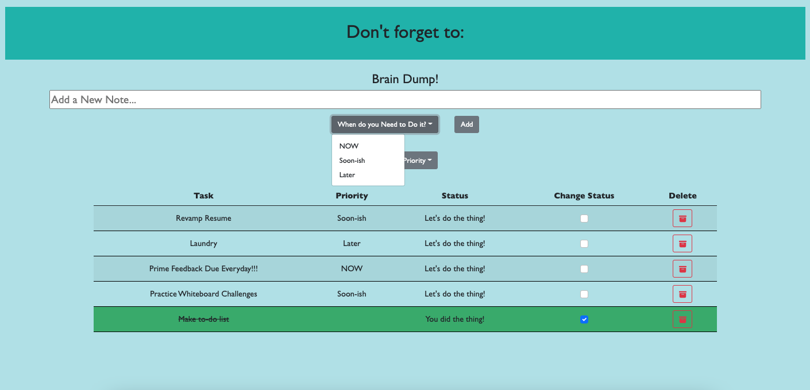

# Full Stack To-do List

## Description

_Duration: 3 Day Sprint_

A to-do list to track the things you do not want to forget!

To see the fully functional site, please visit: [DEPLOYED VERSION OF APP](https://mmettille-to-do-list.herokuapp.com/)

## Screen Shot

## Installation
- Create a database named to-do-list,
- The queries in the database.sql file are set up to create all the necessary tables that you will need to have this app work correctly. The project is built on Postgres, so you will need to make sure to have that installed. I would recommend using Postico to run those queries as that was used to create the queries.
- Open up your editor of choice and run an "npm install"
- Run "npm start" in your terminal
- Open localhost:5000 in your browser and enjoy the app!

## Built With

- HTML 5
- CSS 3
- Javascript
- jQuery
- Bootstrap
- Node.js
- SQL

## Acknowledgement
Thanks to [Prime Digital Academy](www.primeacademy.io) for downloading all this code into my brain.

## Support
If you have suggestions or issues, please email me at [mary.mettille.brist@gmail.com]
